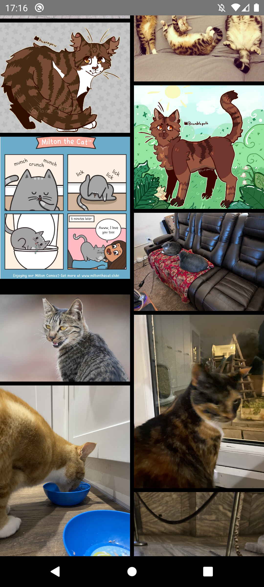
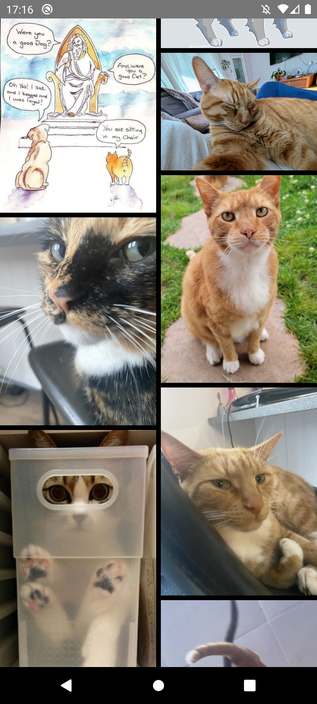

## Imgur API Demo App
Este é um aplicativo simples de demonstração que consome a API do Imgur para listar e exibir galerias de imagens. 
O app é desenvolvido usando Jetpack Compose para a interface de usuário e segue uma arquitetura baseada em ViewModel para gerenciar o estado.

## Funcionalidades
    • Exibe galerias de imagens populares do Imgur.
    • Layout em grade com carregamento dinâmico de imagens.
    • Estados de carregamento e erro com feedback visual.
    • Totalmente implementado com Jetpack Compose para uma UI moderna e responsiva.

## Tecnologias e Princípios Utilizados
    • Kotlin
    • Jetpack Compose
    • Clean Architecture
    • Design Patterns (Padrões de Projeto)
    • Princípios de Clean Code
    • SOLID (Princípios de design de software para código mais flexível e fácil de manter)
    • KISS (Keep It Simple, Stupid - Manter o código simples e objetivo)
    • DRY (Don’t Repeat Yourself - Evitar duplicação de código)

## Captura de Tela
|
|
|